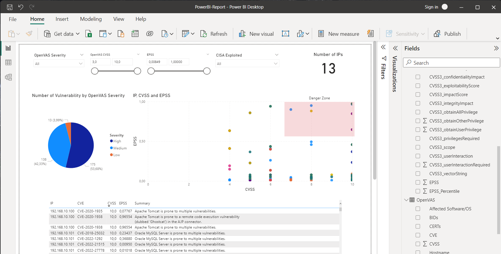
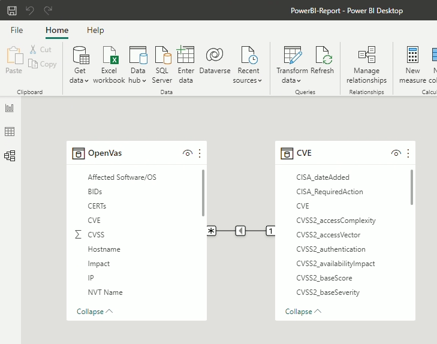

# CVE Vulnerability Information Downloader

Common Vulnerability Scoring System (CVSS) is a free and open industry standard for assessing the severity of computer system security vulnerabilities.  
Exploit Prediction Scoring System (EPSS) estimates the likelihood that a software vulnerability will be exploited in the wild.  
CISA publishes a list of known exploited vulnerabilities.  

This projects downloads the information from the three sources and combines them into one list.  
Scanners show you the CVE number and the CVSS score, but do often not export the full details like "exploitabilityScore" or "userInteractionRequired". By adding the EPSS score you get more options to select what to do first and filter on the thresholds which makes sense for your environment.  
You can use the information to enrich the information provided from your vulnerability scanner like OpenVAS to prioritize remediation.  
You can use tools like PowerBI to combine the results from the vulnerability scanner with the information downloaded by the script in the repository.  

After the download the required information will be extracted, formatted, and output files will be generated.  
CVSS, EPSS and a combined file of all CVE information will be available. Outputs are available in json and csv formats.  
Additionally the information is imported into a sqlite database.  

The goal was not performance or efficiency.  
Instead the script is written in a simple way. Multiple steps are made to make easier to understand and traceable. Files from intermediate steps are written to disk to allow you make it easier for you to adjust the commands to your needs.  
It is only using bash, jq, and sqlite3 to be very beginner friendly and demonstrate the usage of jq.  

## PowerBI Example Dashboard

This repository contains a demo folder with a PowerBI template file. It generate a dashboard which you can adjust to your needs.  



The OpenVAS report must be in the csv format for the import to work.  


PowerBI will use the created CVE.json file and create a relationship:



You can download PowerBI for free from [https://aka.ms/pbiSingleInstaller](https://aka.ms/pbiSingleInstaller) and you don't need an Microsoft account to use it.  

## Configuration

1. Get an NIST API key: https://nvd.nist.gov/developers/request-an-api-key
2. cp env_example .env
3. edit the .env file and add your API key
4. optional: edit docker-compose file and adjust the cron schedule
5. optional: edit data/vulnerability-tables-logstash/config/logstash.conf
6. docker-compose up -d
7. you will find the files in data/vulnerability-tables-cron/output/ after the script completed. It needs several minutes.

## Run

You can either wait for cron to execute the download script on a schedule.  
Alternatively you can execute the download script manually by running:
```
docker exec -it vulnerability-tables-cron bash /opt/scripts/download.sh
```

## Container Description

There are three docker containers.  
The cron container downloads the information once a week (Monday 06:00) and stores the files in the output directory.  
It uses curl and wget to download files. jq is used work with json.  

The filebeat container reads the json files and forwards it to the logstash container.  
The logstash container can be used to send to a OpenSearch instance, upload it to Azure Log Analytics, or other supported outputs.  
Filebeat and logstash are optional and are only included for continence.  

## Example output files

Several output files will be generated. Here is an estimate:
```
316K   CISA_known_exploited.csv
452K   CISA_known_exploited.json
50M    CVSS.csv
179M   CVSS.json
206M   CVE.json
56M    CVE.csv
6.7M   EPSS.csv
12M    EPSS.json
49M    database.sqlite
```

You can expect this information for every CVE:  
```
grep -i 'CVE-2021-44228' CVE.json | jq
{
  "CVE": "CVE-2021-44228",
  "CVSS2_accessComplexity": "AV:N/AC:M/Au:N/C:C/I:C/A:C",
  "CVSS2_accessVector": "NETWORK",
  "CVSS2_authentication": "MEDIUM",
  "CVSS2_availabilityImpact": "NONE",
  "CVSS2_baseScore": "COMPLETE",
  "CVSS2_baseSeverity": "COMPLETE",
  "CVSS2_confidentialityImpact": "COMPLETE",
  "CVSS2_exploitabilityScore": "9.3",
  "CVSS2_impactScore": "null",
  "CVSS2_integrityImpact": "8.6",
  "CVSS2_vectorString": "10",
  "CVSS3_attackComplexity": "null",
  "CVSS3_attackVector": "null",
  "CVSS3_availabilityImpact": "null",
  "CVSS3_baseScore": "null",
  "CVSS3_baseSeverity": "null",
  "CVSS3_confidentialityImpact": "null",
  "CVSS3_exploitabilityScore": "null",
  "CVSS3_impactScore": "null",
  "CVSS3_integrityImpact": "null",
  "CVSS3_privilegesRequired": "null",
  "CVSS3_scope": "null",
  "CVSS3_userInteraction": "null",
  "CVSS3_vectorString": "null",
  "CVSS3_acInsufInfo": "null",
  "CVSS3_obtainAllPrivilege": "null",
  "CVSS3_obtainUserPrivilege": "null",
  "CVSS3_obtainOtherPrivilege": "null",
  "CVSS3_userInteractionRequired": "null",
  "EPSS": "0.97095",
  "EPSS_Percentile": "0.99998",
  "CISA_dateAdded": "2021-12-10",
  "CISA_RequiredAction": "For all affected software assets for which updates exist, the only acceptable remediation actions are: 1) Apply updates; OR 2) remove affected assets from agency networks. Temporary mitigations using one of the measures provided at https://www.cisa.gov/uscert/ed-22-02-apache-log4j-recommended-mitigation-measures are only acceptable until updates are available."
}
```

## Links
- https://www.first.org/epss/user-guide  
- https://www.cisa.gov/known-exploited-vulnerabilities-catalog  
- https://nvd.nist.gov/developers/vulnerabilities  
